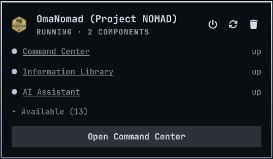

# OmaNomad — one-click Project NOMAD for Omarchy



**OmaNomad** is an Omarchy bar-widget plugin that installs, runs, and manages
[Project NOMAD](https://github.com/Crosstalk-Solutions/project-nomad) — the
offline knowledge server from Crosstalk Solutions — as a native part of your
Omarchy shell. One widget in the bar handles the whole lifecycle: install,
start, stop, stack update, uninstall, and launching the Command Center.

## Why

Project NOMAD ships a Debian-only installer and expects you to babysit Docker
commands from a terminal. OmaNomad ports that installer to Arch, wires it into
`pkexec`/pacman, and gives you a panel instead of a shell session:

```bash
omarchy plugin add https://github.com/SlowburnAZ/omanomad --enable
```

Then click the NOMAD icon in the bar → **Install Project NOMAD**. Docker comes
from the official Arch repos via pacman — no `get.docker.com` script, no
manual group memberships, no re-login.

## Features

**Bar widget with live state.** The NOMAD logo sits in the right section of
your bar and is state-colored: dim when the stack is down, lit when the
Command Center answers on `http://localhost:8080`. Status is polled from an
unprivileged health check (`bin/status.sh`), configurable from 5–3600 s via
the plugin settings.

**Full control panel.** Click the icon and you get a panel with:

- Current status — not-installed / stopped / running / unknown, with the
  failure reason when a check genuinely breaks (e.g. a VPN interfering with
  localhost)
- Per-component view — running components and available ones, each with its
  status and a link where the component exposes one
- **Install** / **Start** / **Stop** / **Stack update** / **Uninstall** —
  destructive actions get confirmation dialogs; long-running steps run in a
  floating terminal so interactive prompts work
- **Open Command Center** — straight to `http://localhost:8080`

**Arch-native installer.** The install script is a faithful port of upstream
`install_nomad.sh` with the right adaptations for Arch: pacman instead of apt,
Docker from the Arch repos with `systemctl enable --now`, correct
`${SUDO_USER}` ownership under `pkexec`, and no forced group re-login.

**Two-level uninstall.** Plain uninstall removes containers, helpers, and the
compose file but keeps your data (`storage/`, `mysql/`, `redis/`, shared
volume). "Delete data too" purges `/opt/project-nomad` entirely — storage is
never deleted without you confirming it twice.

**VPN-aware diagnostics.** If a VPN client breaks localhost HTTP, the panel
tells you that instead of showing a nonsense state — disconnect the VPN and
retry.

## Requirements

- Omarchy (or any Arch-based system), x86_64
- 5 GB free disk space
- Internet for the initial install; after that, Project NOMAD runs fully
  offline

## Links

- Plugin: <https://github.com/SlowburnAZ/omanomad>
- Upstream project: <https://github.com/Crosstalk-Solutions/project-nomad>
- License: MIT (upstream Project NOMAD is Apache-2.0)
